# Atividade 01: Definição de Processo de Software

- **Disciplina:** Engenharia de Software
- **Professor:** Dr. Sandro Ronaldo Bezerra Oliveira
- **Alunos:**
  - [ Alessandro Reali Lopes Silva](https://github.com/reali-705)
  - [ Felipe Lisboa Brasil](https://github.com/FelipeBrasill)

## 1. Contexto e Problema

Este projeto simula a operação de uma Startup, contratada para desenvolver uma aplicação mobile de **Gerenciamento de Sistema Acadêmico**. O desafio consiste em equilibrar a agilidade necessária para uma startup com a robustez exigida por sistemas educacionais.

## 2. Definição do Processo

O processo está estruturado nos seguintes pilares:

- **Atividades:** Divisão lógica das etapas de produção.
- **Artefatos (Entrada/Saída):** Documentação e produtos gerados em cada etapa (Ex: Backlog, Protótipo, Build).
- **Recursos:** Definição de capital humano (PO, Dev, Designer) e ferramentas tecnológicas.
- **Procedimentos:** O "como fazer" técnico para garantir a padronização.

## 3. Diagrama de Processo (Visão Geral)

```mermaid
graph TD
  %% --- Classes Personalizadas ---
  classDef atividade fill:#ef5350,stroke:#212121,stroke-width:2px,font-size:20px,font-weight:bold,color:#111111;
  classDef condicao fill:#ffeb3b,stroke:#f57f17,stroke-width:2px,font-size:16px,color:#111111;
  classDef rh fill:#e0f7fa,stroke:#006064,stroke-width:2px,font-size:14px,color:#111111;
  classDef rnh fill:#f5f5f5,stroke:#616161,stroke-width:2px,font-size:14px,color:#111111;
  classDef artSaida fill:#c8e6c9,stroke:#2e7d32,stroke-width:2px,font-size:14px,color:#111111;
  classDef artEntrada fill:#ffccbc,stroke:#d84315,stroke-width:2px,font-size:14px,color:#111111;
  classDef procedimento fill:#bbdefb,stroke:#0d47a1,stroke-width:2px,font-size:14px,stroke-dasharray:5 5,color:#111111;

  %% --- Fluxo Principal ---
  subgraph P1[Elicitação de Requisitos]
    direction LR
    Inicio(( )) ==>
    Atv1([Levantar<br/>requisitos]) ==>
    Atv2([Desenvolver<br/>protótipo<br/>não funcional]) ==>
    Atv3([Reunir com<br/>o cliente]) ==>
    Cond1{Protótipo<br/>aceito?} ==>|Sim| Atv4
    Cond1 ==>|Não| Atv1
  end

  subgraph P2[Contrução do Produto]
    direction TB
    Atv4([Definir<br/>ferramentas]) ==>
    Atv5([Definir<br/>modelagem]) ==>
    Atv6([Implementar<br/>funções básicas]) ==>
    Atv7([Testar<br/>funções básicas]) ==>
    Atv8([Implementar<br/>funções gerais]) ==>
    Atv9([Testar<br/>funções gerais]) ==>
    Cond2{Falhas nos<br/>testes?} ==>|Sim| Atv5
    Cond2 ==>|Não| Atv10
  end

  subgraph P3[Entrega e Manutenção]
    direction RL
    Atv10([Apresentar<br/>ao cliente]) ==>
    Cond3{Aprovado?} ===>|Sim| Atv12
    Cond3 ==>|Não| Atv11
    Atv11([Analisar<br/>Falhas]) ==>
    Cond4{Falha<br/>críticas?} ==>|Sim| Atv1
    Cond4 ==>|Não| Atv5
    Atv12([Inicar<br/>deploy]) ==>
    Atv13([Manter<br/>manuntenção]) ==>
    Fim((( )))
  end

  subgraph D1[Levantamento de Requisitos]
    direction LR
    RH1([👥 Product Owner e Cliente]) 
    RNH1([💻 Software de Comunicação e Docs]) 
    ArtE1{{📄 Relato de Necessidades do Cliente}} 
    ArtS1{{📝 Documento de Visão / Backlog}} 
    Proc1[Reuniões de Elicitação e Análise<br/>Realizar entrevistas com stakeholders, identificar dores do sistema acadêmico e priorizar requisitos para o MVP.] 
  end

  subgraph D2[Prototipagem Visual]
    direction LR
    RH2([🎨 Designer UI/UX]) 
    RNH2([🖌️ Ferramenta de Design/Prototipagem]) 
    ArtE2{{📝 Backlog de Requisitos}} 
    ArtS2{{📱 Protótipo de Alta Fidelidade}} 
    Proc2[Criação de Interfaces e Fluxo de Usuário<br/>Desenvolver wireframes de baixa fidelidade e evoluir para protótipos navegáveis focados na experiência do aluno.] 
  end

  subgraph D3[Validação de Escopo]
    direction LR
    RH3([👥 Product Owner e Cliente]) 
    RNH3([💻 Plataforma de Apresentação]) 
    ArtE3{{📱 Protótipo de Alta Fidelidade}} 
    ArtS3{{📋 Ata de Validação / Feedback}} 
    Proc3[Demonstração e Homologação de Design<br/>Apresentar o fluxo de telas ao cliente para validar se a interface atende aos requisitos levantados anteriormente.] 
  end

  subgraph D4[Definição de Ferramentas]
    direction LR
    RH4([👤 Tech Lead / Desenvolvedor]) 
    RNH4([💻 IDEs, Sistemas e Git]) 
    ArtE4{{📝 Protótipo e Requisitos}} 
    ArtS4{{📋 Documento de Stack Técnica}} 
    Proc4[Seleção de Frameworks, DB e Ambientes<br/>Analisar requisitos de performance e escalabilidade para definir a stack. Ex: FastAPI para backend e React Native para mobile.] 
  end

  subgraph D5[Modelagem do Sistema]
    direction LR
    RH5([👤 Analista de Sistemas / Dev]) 
    RNH5([🖌️ Software de Modelagem UML/ER]) 
    ArtE5{{📋 Documento de Stack Técnica}} 
    ArtS5{{📐 Diagramas de Classe, ER e Regras}} 
    Proc5[Modelagem de Backend e Banco de Dados<br/>Projetar o esquema relacional no PostgreSQL e definir os endpoints da API seguindo os princípios RESTful.] 
  end

  subgraph D6[Implementar Funções Básicas]
    direction LR
    RH6([👤 Desenvolvedor Fullstack]) 
    RNH6([💻 VS Code, Docker, Frameworks]) 
    ArtE6{{📐 Diagramas de Classe, ER e Regras}} 
    ArtS6{{📦 Código-fonte do Core / API}} 
    Proc6[Codificação de Módulos Críticos<br/>Desenvolver funcionalidades essenciais como cadastro de alunos, autenticação e gerenciamento de cursos.] 
  end

  subgraph D7[Testes de Funções Básicas]
    direction LR
    RH7([👤 Desenvolvedor / Autoteste]) 
    RNH7([🧪 Frameworks de Testes Unitários]) 
    ArtE7{{📦 Código-fonte do Core / API}} 
    ArtS7{{📊 Relatório de Testes Unitários}} 
    Proc7[Execução de Testes de Unidade e Lógica<br/>Desenvolver e executar scripts de testes unitários para validar a lógica de negócio e garantir a integridade das funções core.] 
  end

  subgraph D8[Implementar Funções Gerais]
    direction LR
    RH8([👤 Desenvolvedor Fullstack]) 
    RNH8([💻 VS Code, Docker, Frameworks]) 
    ArtE8{{📦 Código-fonte do Core / API}} 
    ArtS8{{📱 Build Funcional - Beta}} 
    Proc8[Codificação de Funcionalidades Complementares<br/>Adicionar funcionalidades adicionais como notificações, integração com calendários e relatórios de desempenho.] 
  end

  subgraph D9[Testes de Funções Gerais]
    direction LR
    RH9([👤 QA / Analista de Testes]) 
    RNH9([🧪 Ferramentas de Teste Integrado]) 
    ArtE9{{📱 Build Funcional - Beta}} 
    ArtS9{{📑 Relatório de Homologação / Bugs}} 
    Proc9[Testes de Integração e Funcionalidade<br/>Validar a comunicação entre frontend e backend em ambiente controlado, identificando bugs de fluxo e usabilidade.] 
  end

  subgraph D10[Apresentação ao Cliente]
    direction LR
    RH10([👥 Product Owner e Cliente]) 
    RNH10([💻 Plataforma de Demonstração / Device]) 
    ArtE10{{📱 Build Funcional - Beta}} 
    ArtS10{{📜 Termo de Aceite / Lista de Ajustes}} 
    Proc10[Demonstração Final e Validação de Escopo<br/>Realizar um 'showcase' da aplicação funcional para o cliente, simulando o uso real em dispositivos mobile. Coletar feedback e obter a aprovação formal para avançar para o deploy.] 
  end

  subgraph D11[Análise de Falhas]
    direction LR
    RH11([👥 Product Owner e Analista de Sistemas]) 
    RNH11([📊 Relatórios de Erro / Logs]) 
    ArtE11{{📑 Relatório de Homologação Negativo}} 
    ArtS11{{🛠️ Plano de Correção / Novo Backlog}} 
    Proc11[Análise de Causa Raiz e Gravidade da Falha<br/>Identificar as causas subjacentes aos problemas encontrados e avaliar sua gravidade para priorizar as correções.] 
  end

  subgraph D12[Início do Deploy]
    direction LR
    RH12([👤 DevOps / Desenvolvedor]) 
    RNH12([🏪 Google Play Store / Apple App Store]) 
    ArtE12{{📦 Build Estável - Release Candidate}} 
    ArtS12{{🌐 Link da Aplicação Publicada}} 
    Proc12[Submissão, Revisão e Lançamento nas Lojas<br/>Gerar o build de produção, assinar digitalmente a aplicação e gerenciar o processo de revisão nas lojas Play/App Store.] 
  end

  subgraph D13[Manutenção e Monitoramento]
    direction LR
    RH13([👤 Desenvolvedor / Suporte]) 
    RNH13([💬 Dashboard de Comentários e Crashlytics]) 
    ArtE13{{⭐ Feedback de Usuários e Logs de Erro}} 
    ArtS13{{🔧 Patches de Correção / Updates}} 
    Proc13[Monitoramento de Performance e Correção de Bugs<br/>Acompanhar o feedback dos usuários e os logs de erro para identificar áreas de melhoria e lançar atualizações regulares.] 
  end

  Atv1 -.- D1
  Atv2 -.- D2
  Atv3 -.- D3
  Atv4 -.- D4
  Atv5 -.- D5
  Atv6 -.- D6
  Atv7 -.- D7
  Atv8 -.- D8
  Atv9 -.- D9
  Atv10 -.- D10
  Atv11 -.- D11
  Atv12 -.- D12
  Atv13 -.- D13

  class Atv1,Atv2,Atv3,Atv4,Atv5,Atv6,Atv7,Atv8,Atv9,Atv10,Atv11,Atv12,Atv13 atividade
  class Cond1,Cond2,Cond3,Cond4,Cond5 condicao
  class RH1,RH2,RH3,RH4,RH5,RH6,RH7,RH8,RH9,RH10,RH11,RH12,RH13 rh
  class RNH1,RNH2,RNH3,RNH4,RNH5,RNH6,RNH7,RNH8,RNH9,RNH10,RNH11,RNH12,RNH13 rnh
  class ArtE1,ArtE2,ArtE3,ArtE4,ArtE5,ArtE6,ArtE7,ArtE8,ArtE9,ArtE10,ArtE11,ArtE12,ArtE13 artEntrada
  class ArtS1,ArtS2,ArtS3,ArtS4,ArtS5,ArtS6,ArtS7,ArtS8,ArtS9,ArtS10,ArtS11,ArtS12,ArtS13 artSaida
  class Proc1,Proc2,Proc3,Proc4,Proc5,Proc6,Proc7,Proc8,Proc9,Proc10,Proc11,Proc12,Proc13 procedimento
```

