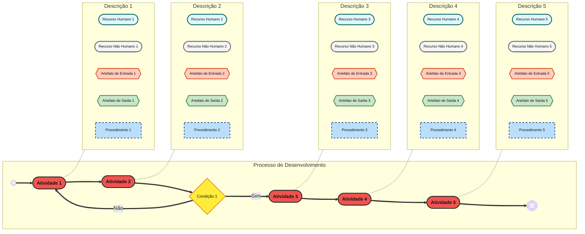

# Especificação do Processo de Desenvolvimento - Startup Acadêmica

Este documento detalha o processo de engenharia de software para o desenvolvimento do sistema de gerenciamento acadêmico mobile, focando em **redução de danos** e **otimização de custos de oportunidade**.

## 1. Diagrama de Processo (Visão Geral)

