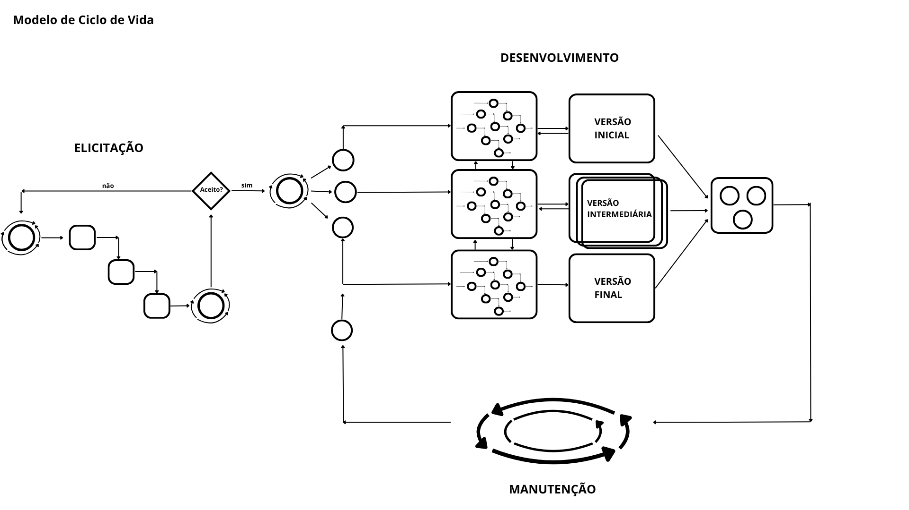

# Atividade 2 - Criação de Modelo de Ciclo de Vida

## Universidade Federal do Pará (UFPA)

### Instituto de Ciências Exatas e Naturais (ICEN)

#### Bacharelado em Ciência da Computação

| Alunos | Matrículas |
| --- | :-: |
| **Alessandro Reali Lopes Silva** | 202304940049 |
| **Felipe Lisboa Brasil** | 202404940029 |

---

## 1. Contexto do Projeto

Este projeto foi desenvolvido para a disciplina de Engenharia de Software com o objetivo de propor um modelo de ciclo de vida customizado. O cenário consiste na criação de um modelo de ciclo de vida de software onde a agilidade é mandatória para acompanhar o mercado, mas a modularidade e a documentação são cruciais para a sobrevivência do produto a longo prazo.

Diferente de modelos puramente tradicionais ou estritamente ágeis, este modelo híbrido utiliza a técnica de Process Tailoring (alfaiataria de processos). Ele busca equilibrar requisitos iniciais nebulosos com uma entrega final extremamente robusta, garantindo que o desenvolvimento de módulos ocorra de forma independente e que a manutenção seja guiada por uma análise de riscos constante.

O cenário proposto é o desenvolvimento de um ecossistema de software onde os requisitos iniciais são nebulosos, mas a entrega final deve ser extremamente robusta. Para isso, em vez de adotar uma metodologia única e limitada, este documento detalha a criação de um modelo customizado, "costurado" a partir das forças de modelos consagrados como Cascata, RAD, Incremental, Protótipo, Evolucionário e Ciclíco. A proposta visa demonstrar como a seleção estratégica de características de diferentes ciclos de vida pode mitigar riscos específicos em cada etapa da engenharia — desde a elicitação até a manutenção.

## 2. Metodologia

A metodologia aplicada para a concepção do ciclo de vida deste projeto baseia-se em um pipeline de **Análise Comparativa e Síntese de Processos**. O objetivo foi identificar as forças de modelos consagrados na literatura para compor um fluxo que atenda simultaneamente aos requisitos de **agilidade, modularidade e documentação**.

### 2.1. Levantamento e Matriz de Decisão

Primeiramente, realizou-se o levantamento das características intrínsecas dos modelos clássicos. Esta matriz serviu como base analítica para a seleção dos componentes do modelo híbrido proposto.

| Característica | Cascata | Prototipagem | RAD | Incremental | Evolucionário | Espiral |
| --- | :-: | :-: | :-: | :-: | :-: | :-: |
| **Filosofia** | Linear | Experimental | Velocidade | Partição | Refinamento | Redução Danos |
| **Requisitos** | Fixos no início | Incertos | Modularizáveis | Evolutivos | Em Evolução | Complexos |
| **Entrega** | Final (Única) | Protótipos | Por Módulo | Por Partes | Versões | Ciclo PDCA |
| **Feedback** | Tardio | Constante | Alto | Frequente | Cíclico | Constante |
| **Risco** | Reativo | Baixo (UX) | Médio | Distribuído | Controlado | Mínimo |
| **Documentação** | Exaustiva | Mínima | Suficiente | Moderada | Dinâmica | Alta (Riscos) |
| **Custo Mudança** | Altíssimo | Baixo | Baixo | Médio | Baixo | Baixo |
| **Ideal para...** | Projetos Críticos | Validar Requisitos | Sistemas Modulares | Entrega de Valor Cedo | Sistemas Adaptáveis | Projetos de Alto Risco |

### 2.2. Seleção de Critérios por Estágio

Com base na matriz, a segunda etapa da metodologia foi a **Filtragem de Critérios**. Para cada fase do ciclo de vida (Elicitação, Desenvolvimento e Manutenção), foram selecionados os modelos que apresentavam as melhores respostas aos desafios específicos de agilidade e independência de módulos, criando um pipeline de transição entre filosofias.

### 2.3. Síntese e Modelagem do Ciclo de Vida

A etapa final envolveu a síntese dos critérios selecionados para a modelagem de um fluxo híbrido. Nesta fase, os componentes foram "costurados" para garantir que a saída de um estágio (ex: protótipo validado) servisse como entrada otimizada para o próximo (ex: desenvolvimento modular), assegurando a consistência da documentação e a modularidade do sistema.

## 3. Resultados: O Modelo Híbrido Proposto

A aplicação da metodologia de análise resultou na concepção de um ciclo de vida personalizado, que integra seis modelos clássicos para otimizar as fases de Elicitação, Desenvolvimento e Manutenção.

### 3.1. Descrição do Ciclo de Vida Resultante

O modelo final opera como um pipeline de três estágios, onde a lógica de cada fase foi construída para garantir agilidade e independência modular:

1. **Elicitação (Cascata + Prototipagem):** Cada protótipo não funcional é feito por uma pequena ideia/requisito que o cliente passa. Ademais, para agilizar a produção, é feita uma cascata para o desenvolvimento do protótipo; algo que não perde tempo para uma "pequena falha", apenas documenta tudo e entrega o produto no final, mesmo que tenha "erros".
2. **Desenvolvimento (RAD + Evolucionário):** Utiliza-se a agilidade do RAD para a divisão de cascatas/módulos independentes que vão se desenvolvendo com base em versões iniciais -> testes -> finais. Essa abordagem visa aumentar a precisão e a robustez do projeto através da evolução contínua de cada componente.
3. **Manutenção (Incremental + Espiral):** Depois do projeto funcional ser feito e aprovado, a adição de novas funcionalidades e correções de bugs será feita constantemente em uma espiral de análise e tratamento de novos requisitos. A partir disso, é produzido o novo módulo ou patch de correção a ser entregue de forma incremental ao projeto.

### 3.2. Análise da Independência de Módulos

O resultado mais significativo deste modelo é a **Independência de Desenvolvimento**. Através da combinação RAD + Evolucionário, o projeto deixa de ser um bloco único (monolítico) e passa a ser uma coleção de serviços independentes, permitindo que falhas em um módulo de manutenção não paralisem o desenvolvimento de novas funcionalidades.

### 3.3. Matriz de Contribuição e Justificativa

A tabela abaixo consolida a fundamentação técnica de como cada modelo original contribui para a robustez do processo final.

| Modelo Original | Contribuição para o Modelo Híbrido | Justificativa de Engenharia |
| :--- | :--- | :--- |
| **Cascata** | Documentação e marcos fixos na Elicitação | Garante a rastreabilidade e um "contrato" de requisitos claro antes de codificar. |
| **Prototipagem** | Validação visual binária | Reduz o risco de construir uma interface ineficaz, economizando custo de oportunidade. |
| **RAD** | Modularização e foco em ferramentas | Garante a velocidade necessária através do desenvolvimento paralelo e reúso de componentes. |
| **Evolucionário** | Gestão de versões e refinamento de módulos | Permite que o software amadureça organicamente entre ambientes de teste e produção. |
| **Incremental** | Entrega por funcionalidades (Features) | Permite a entrega de um MVP funcional enquanto outros módulos são desenvolvidos. |
| **Espiral** | Análise de risco contínua na manutenção | Protege o sistema contra falhas críticas, forçando revisões profundas quando o risco é alto. |

### 3.4. Diagrama do Ciclo de vida

A tabela abaixo ilustra o processo geral do ciclo de vida:

  
  
<em>Figura 1: Representação do Modelo de Ciclo de Vida Híbrido Proposto.</em>

### 4. Conclusão

O modelo híbrido proposto conseguiu integrar agilidade, modularidade e documentação ao combinar diferentes abordagens clássicas de engenharia de software. Essa estrutura favorece a validação contínua de requisitos, o desenvolvimento modular e uma manutenção orientada a riscos.

No entanto, o modelo apresenta limitações. Sua complexidade exige maior maturidade da equipe, tanto na aplicação das práticas quanto na gestão das transições entre etapas. Além disso, a dependência de documentação e comunicação eficaz pode gerar dificuldades em cenários com equipes menos experientes. Por fim, em ambientes de alta volatilidade, as constantes adaptações podem aumentar o custo e o esforço do processo.

Assim, o modelo é mais adequado para projetos que buscam equilíbrio entre rapidez e robustez, desde que haja uma gestão bem estruturada.

## Referências

- SOMMERVILLE, Ian. *Engenharia de Software*. 10. ed
- Slides da disciplina de Engenharia de Software - Prof. Dr. Sandro Bezerra, UFPA.
