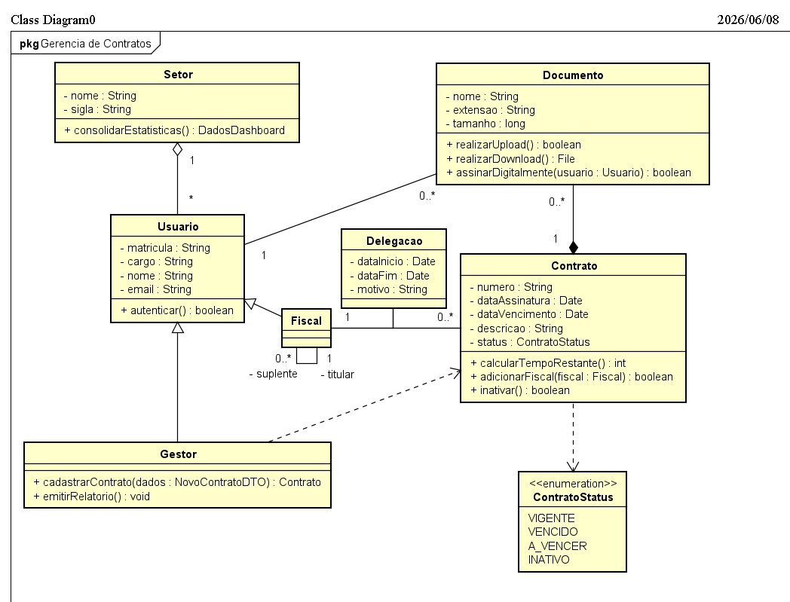

# Trabalho 06 - Análise do Diagrama de Classes UML

## Universidade Federal do Pará (UFPA)

### Instituto de Ciências Exatas e Naturais (ICEN)

#### Bacharelado em Ciência da Computação

| Alunos | Matrículas |
| --- | :-: |
| **Alessandro Reali Lopes Silva** | 202304940049 |
| **Felipe Lisboa Brasil** | 202404940029 |

---

## 1. Contexto

Este documento apresenta a justificativa das decisões de modelagem tomadas na construção do Diagrama de Classes UML do sistema **Gerência de Contratos**. Cada escolha estrutural — classes, atributos, métodos, associações e hierarquias — é argumentada com base nos Requisitos Funcionais RF-01, RF-02 e RF-03 especificados no Trabalho 05, demonstrando a rastreabilidade direta entre o modelo e os requisitos que o originaram.

---

## 2. Diagrama de Classes

  
  
<em>Figura 1: Diagrama de Classes UML do sistema Gerência de Contratos (2026/06/08).</em>

---

## 3. Justificativa das Decisões de Modelagem

### 3.1. Classe `Contrato`

A classe `Contrato` é o núcleo do sistema e seus atributos foram definidos diretamente a partir do RF-01, que determina os dados obrigatórios a serem persistidos no cadastro:

> *"armazenando obrigatoriamente as seguintes informações: Número do processo do contrato; Data de assinatura (ou vigência); Descrição do objeto do contrato; Identificação do responsável (fiscal) pelo contrato."*

Desse trecho derivam os atributos `numero : String`, `dataAssinatura : Date`, `dataVencimento : Date` e `descricao : String`. O campo de identificação do fiscal não foi colocado como atributo primitivo em `Contrato`, mas sim resolvido por meio da associação com a classe `Fiscal` e do método `adicionarFiscal(fiscal : Fiscal) : boolean` — decisão que preserva a normalização do modelo e evita redundância de dados.

O atributo `status : ContratoStatus` e o método `calcularTempoRestante() : int` foram incluídos para atender ao RF-03, que exige que o sistema calcule e exiba dinamicamente a situação de cada contrato:

> *"O sistema calcula o tempo restante de vigência (comparando a data atual com a data de término) e define o status do contrato (vigente, vencido ou a vencer)."*

Em vez de armazenar o status como um campo calculado na aplicação sem representação no modelo, optamos por torná-lo um atributo gerenciado pela própria classe, com o método responsável pela lógica de derivação — o que torna o comportamento explícito no contrato da classe.

O método `inativar() : boolean` foi adicionado por antecipação ao ciclo de vida natural de um contrato público, que necessariamente passa por um estado de encerramento formal. Embora não exista RF explícito para essa operação, ela é coerente com o domínio e será documentada como requisito nas próximas iterações.

---

### 3.2. Enumeração `ContratoStatus`

A criação de uma enumeração dedicada `ContratoStatus`, em vez do uso de uma `String` livre, foi uma decisão deliberada de robustez. O RF-03 delimita com precisão os estados válidos de um contrato:

> *"status atual (vigente, vencido ou a vencer)"*

Os literais `VIGENTE`, `VENCIDO` e `A_VENCER` mapeiam diretamente esses três estados. O literal `INATIVO` foi acrescentado para suportar o método `inativar()` e representar contratos encerrados administrativamente — um estado que o domínio jurídico exige, ainda que não tenha sido formalizado em RF até o momento.

Usar uma enumeração garante que nenhum valor inválido possa ser atribuído ao status de um contrato em tempo de compilação, o que é especialmente relevante dado que o RF-03 define alertas visuais condicionados a esse valor:

> *"emitir alertas visuais conforme a proximidade da data de término"*

---

### 3.3. Classe `Documento`

A classe `Documento` foi modelada para refletir as regras de negócio centrais do RF-02. Os dois atributos de validação — `extensao : String` e `tamanho : long` — correspondem diretamente às duas checagens obrigatórias descritas no fluxo principal:

> *"O sistema intercepta o arquivo e valida se a extensão é .pdf ou .docx."*  
> *"O sistema valida se o tamanho do arquivo é menor ou igual a 5MB."*

Esses atributos não são apenas metadados descritivos: eles são a base sobre a qual o método `realizarUpload() : boolean` executa sua lógica de validação antes de persistir o arquivo, conforme o fluxo do RF-02 descreve em sequência. O método `realizarDownload() : File` e `assinarDigitalmente(usuario : Usuario) : boolean` foram incluídos por extensão natural do domínio de gestão documental, antecipando funcionalidades que o sistema precisará suportar.

A associação de composição entre `Contrato` e `Documento` (multiplicidade `1` para `0..*`) é justificada pelo FA-03 do RF-02, que descreve o upload de documento como uma operação vinculada a um contrato específico:

> *"O sistema registra no banco de dados o vínculo desse ID com o registro da tela atual."*

A composição — e não uma simples associação — foi escolhida porque um `Documento` dentro deste sistema não existe de forma independente: ele nasce vinculado a um `Contrato` e seu ciclo de vida é dependente dele.

---

### 3.4. Hierarquia `Usuario` → `Gestor` / `Fiscal`

A decisão de criar uma hierarquia de generalização partiu da observação de que os três RFs definem atores com perfis e permissões distintos, mas que compartilham uma base comum de autenticação. O RF-01 e o RF-02 exigem explicitamente que seus respectivos atores estejam autenticados:

> *"O gestor de contratos deve estar autenticado no sistema com um perfil que possua permissão de escrita para o módulo de contratos."*  
> *"O cliente deve estar autenticado no sistema com um perfil que possua permissão de escrita para realizar o upload de arquivos."*

Em vez de duplicar o comportamento de autenticação em classes separadas, centralizamos o método `autenticar() : boolean` na superclasse `Usuario`, aplicando o princípio de herança para que `Gestor` e `Fiscal` herdem essa capacidade sem repetição.

A subclasse `Gestor` é derivada diretamente do RF-01, onde ele é o ator responsável pelo cadastro de contratos:

> *"Ator: gestor de contratos"*

A subclasse `Fiscal` é derivada do campo obrigatório do RF-01 que exige a identificação do responsável pelo contrato:

> *"Identificação do responsável (fiscal) pelo contrato"*

Modelar `Fiscal` como subclasse de `Usuario` — e não como um atributo de texto simples em `Contrato` — reflete que o fiscal é uma pessoa autenticada no sistema, com identidade própria, e não apenas um campo descritivo.

---

### 3.5. Autoassociação em `Fiscal` e Classe `Delegacao`

A autoassociação da classe `Fiscal` com os papéis `titular` e `suplente` foi modelada a partir de uma regra de negócio identificada durante o levantamento informal com o cliente: contratos públicos frequentemente exigem a designação de um fiscal titular e de um suplente para garantir a continuidade da fiscalização. A classe `Delegacao` complementa esse mecanismo, registrando os períodos em que a responsabilidade é transferida entre fiscais, com os atributos `dataInicio : Date`, `dataFim : Date` e `motivo : String`.

Reconhecemos que essas decisões não possuem RF formal correspondente nos documentos entregues até o momento. Elas representam uma antecipação de design baseada no domínio jurídico-administrativo e deverão ser formalizadas como requisitos nas próximas iterações do projeto.

---

### 3.6. Classe `Setor`

A classe `Setor` foi incluída para representar a estrutura organizacional à qual os usuários pertencem, com a associação `1` para `*` em relação a `Usuario`. O método `consolidarEstatisticas() : DadosDashboard` foi adicionado para suportar a pré-condição do RF-03, que menciona o Dashboard Principal como ponto de entrada para a gestão de prazos:

> *"O usuário deve estar posicionado na tela de 'Lista de Contratos', no 'Dashboard Principal' ou qualquer outra tela que envolva gerência de contratos."*

A consolidação de estatísticas por setor é a operação natural que alimenta esse dashboard, e atribuí-la à classe `Setor` distribui a responsabilidade de forma coerente com o domínio.

---

## 5. Conclusão

O diagrama foi construído priorizando a rastreabilidade direta com os requisitos funcionais, de forma que cada atributo e método relevante possa ser justificado por pelo menos um trecho dos RFs especificados. As exceções — `Delegacao`, a autoassociação de `Fiscal` e o literal `INATIVO` — são extensões deliberadas baseadas no domínio jurídico-administrativo e serão formalizadas como requisitos nas iterações seguintes.

As principais decisões de design — composição entre `Contrato` e `Documento`, generalização de `Usuario`, uso de enumeração para `ContratoStatus` e centralização da lógica de prazo no método `calcularTempoRestante()` — foram tomadas para garantir robustez, evitar redundância e tornar o comportamento do sistema explícito no próprio modelo.

---

## Referências

- SOMMERVILLE, Ian. *Engenharia de Software*. 10. ed.
- Slides da disciplina de Engenharia de Software — Prof. Dr. Sandro Bezerra, UFPA.
- Documentos de requisitos RF-01, RF-02 e RF-03 — Trabalho 05, Turma 2026.
